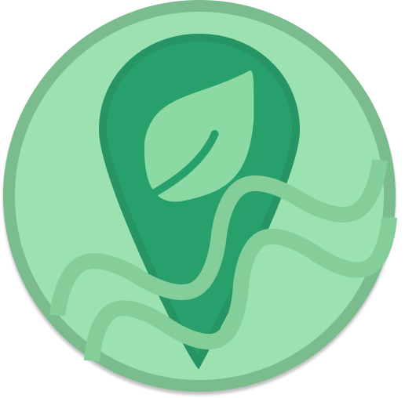
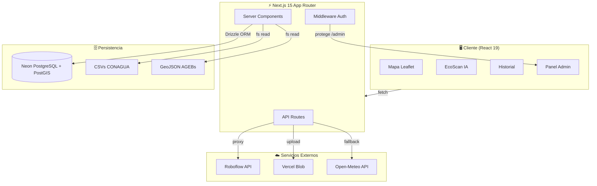
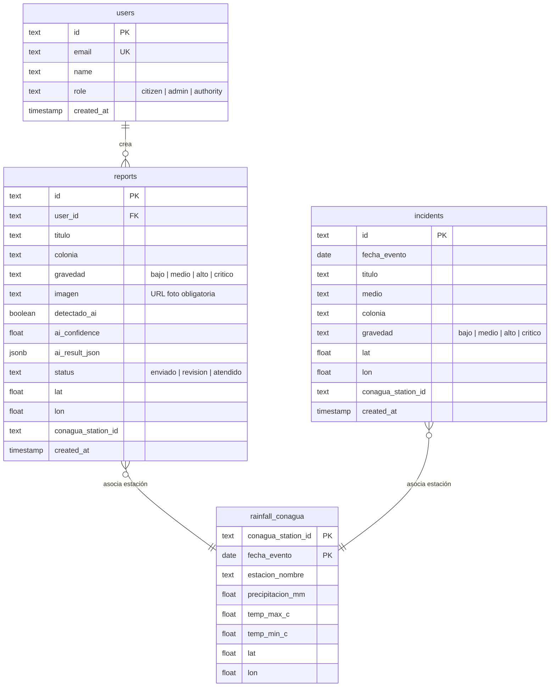

<div align="center">



# 🌍 EcoTrack

### Cartografía Participativa de Riesgos Ambientales

**Plataforma inteligente de monitoreo de inundaciones y contaminación para Hermosillo, Sonora.**
Combina reportes ciudadanos en tiempo real, detección automática por IA y análisis de datos históricos de CONAGUA.

[](https://nextjs.org/)
[](https://react.dev/)
[](https://www.typescriptlang.org/)
[](https://tailwindcss.com/)
[](https://vercel.com/)
[](LICENSE)

</div>

---

## 📑 Tabla de Contenidos

- [Funcionalidades](#-funcionalidades)
- [Arquitectura](#-arquitectura)
- [Stack Tecnológico](#-stack-tecnológico)
- [Estructura del Proyecto](#-estructura-del-proyecto)
- [Inicio Rápido](#-inicio-rápido)
- [Variables de Entorno](#-variables-de-entorno)
- [Modelo de Datos](#-modelo-de-datos)
- [API Reference](#-api-reference)
- [Deploy](#-deploy)
- [Testing](#-testing)
- [Licencia](#-licencia)

---

## ✨ Funcionalidades

<table>
<tr>
<td width="50%">

### 🗺️ Mapa Interactivo
Visualización geoespacial con **Leaflet** que muestra reportes ciudadanos, incidentes de noticias y capas AGEB (urbanas, rurales, municipales). Marcadores codificados por color según gravedad del evento.

</td>
<td width="50%">

### 🤖 EcoScan IA
Motor de detección automática de contaminación visual powered by **Roboflow**. Sube una foto → el modelo identifica basura, residuos y contaminantes → genera bounding boxes y un reporte PDF descargable.

</td>
</tr>
<tr>
<td width="50%">

### 📊 Historial Meteorológico
Gráficas interactivas de precipitación anual y mensual con **Recharts**. Si `DATABASE_URL` está configurado, usan la tabla `rainfall_conagua` en **Neon** como fuente principal; en entornos sin base de datos, usan la serie oficial de **CONAGUA** (CSV local) con fallback a **Open-Meteo**.

</td>
<td width="50%">

### 🛡️ Panel de Administración
Dashboard protegido por autenticación para gestionar reportes ciudadanos: filtrar por estado (`enviado`, `revisión`, `atendido`), actualizar estatus y revisión rápida de evidencia fotográfica.

</td>
</tr>
<tr>
<td width="50%">

### 📝 Reportes Ciudadanos
Formulario de reporte con **foto obligatoria** como evidencia, extracción automática de coordenadas GPS vía EXIF, enriquecimiento con metadata de IA y geolocalización en el mapa.

</td>
<td width="50%">

### 📄 Generación de PDF
Exporta detecciones de IA como reportes PDF profesionales con **jsPDF**: incluye imagen original, bounding boxes, confianza del modelo e información de ubicación.

</td>
</tr>
</table>

---

## 🏗️ Arquitectura



---

## 🛠️ Stack Tecnológico

| Capa | Tecnología | Propósito |
|------|-----------|-----------|
| **Framework** | Next.js 15 (App Router + Turbopack) | SSR, API routes, routing basado en archivos |
| **UI** | React 19 + Tailwind CSS v4 | Componentes reactivos con glassmorphism |
| **Lenguaje** | TypeScript 5.7 | Tipado estricto end-to-end |
| **Mapas** | react-leaflet 5 + Leaflet | Mapas interactivos con capas GeoJSON |
| **Gráficas** | Recharts | Visualización de datos de precipitación |
| **IA** | Roboflow (server-side proxy) | Detección de contaminación en imágenes |
| **Base de Datos** | Drizzle ORM + Neon PostgreSQL | ORM type-safe con PostgreSQL serverless |
| **Geoespacial** | PostGIS | Queries espaciales y geometría de puntos |
| **Auth** | NextAuth v5 (JWT + Credentials) | Autenticación con roles (`citizen`, `admin`, `authority`) |
| **Storage** | Vercel Blob | Almacenamiento de fotos de reportes |
| **PDF** | jsPDF | Generación de reportes descargables |
| **Validación** | Zod | Esquemas de validación en API y formularios |
| **Testing** | Vitest + Testing Library | Tests unitarios y de componentes |
| **Deploy** | Vercel | CI/CD automático desde GitHub |

---

## 📁 Estructura del Proyecto

```
ecotrack/
├── 📂 src/
│   ├── 📂 app/                        # App Router — páginas y API
│   │   ├── page.tsx                   # 🗺️ Mapa principal (SSR)
│   │   ├── home-client.tsx            # Componente cliente del mapa
│   │   ├── layout.tsx                 # Layout raíz (Navbar + Toaster)
│   │   ├── 📂 detector/              # 🤖 EcoScan IA
│   │   ├── 📂 historico/             # 📊 Historial meteorológico
│   │   ├── 📂 admin/                 # 🛡️ Panel admin (protegido)
│   │   ├── 📂 login/                 # 🔐 Autenticación
│   │   └── 📂 api/
│   │       ├── analyze/               #   POST — Proxy a Roboflow
│   │       ├── reports/               #   GET · POST · PATCH
│   │       ├── incidents/             #   GET · POST
│   │       ├── rainfall-conagua/      #   GET · POST (upsert)
│   │       ├── upload/                #   POST — Foto → Vercel Blob
│   │       ├── health/                #   GET — Health check
│   │       └── auth/                  #   NextAuth endpoints
│   │
│   ├── 📂 components/
│   │   ├── map/                       # Mapa Leaflet + capas AGEB
│   │   ├── charts/                    # Gráficas Recharts
│   │   ├── detector/                  # Canvas, upload, resultados IA
│   │   ├── forms/                     # Formulario de reportes
│   │   ├── sidebar/                   # Panel lateral informativo
│   │   ├── layout/                    # Navbar, Footer, MobileNav
│   │   └── ui/                        # Spinner, AnimatedCounter
│   │
│   ├── 📂 lib/
│   │   ├── db/                        # Drizzle schema + conexión Neon
│   │   ├── api/                       # Funciones cliente fetch
│   │   ├── schemas/                   # Validación Zod
│   │   ├── data/                      # Carga CSV + estadísticas
│   │   ├── map/                       # Iconos personalizados Leaflet
│   │   ├── exif/                      # Extracción GPS de EXIF
│   │   ├── pdf/                       # Generación de reportes PDF
│   │   ├── images/                    # Utilidades de imágenes
│   │   ├── hooks/                     # Custom React hooks
│   │   └── storage/                   # Upload a Vercel Blob
│   │
│   └── middleware.ts                  # Protección de rutas /admin/*
│
├── 📂 public/
│   ├── data/                          # CSVs históricos + incidents.json
│   ├── geojson/                       # Capas AGEB (3 archivos GeoJSON)
│   ├── logo/                          # EcoTrack.png
│   └── icons/                         # Favicons
│
├── 📂 drizzle/migrations/            # Migraciones SQL (PostGIS)
├── 📂 scripts/                        # Seeds y utilidades de datos
├── 📂 legacy/                         # Versión anterior (FastAPI + HTML/JS)
│
├── drizzle.config.ts                  # Configuración Drizzle Kit
├── next.config.ts                     # Configuración Next.js
├── vitest.config.ts                   # Configuración de tests
├── vercel.json                        # Config de deploy
├── package.json
└── tsconfig.json
```

---

## 🚀 Inicio Rápido

### Prerrequisitos

- **Node.js** ≥ 18
- **npm** ≥ 9
- Una base de datos [Neon](https://neon.tech/) con PostGIS habilitado
- (Opcional) Cuenta de [Roboflow](https://roboflow.com/) para detección IA

### 1. Clonar e instalar

```bash
git clone https://github.com/BlueDisplay/EcoTrack.git
cd EcoTrack
npm install
```

### 2. Configurar variables de entorno

```bash
cp .env.example .env.local
```

Edita `.env.local` con tus credenciales (ver sección [Variables de Entorno](#-variables-de-entorno)).

### 3. Ejecutar migraciones

```bash
npm run db:push
```

### 4. Iniciar el servidor de desarrollo

```bash
npm run dev
```

La app arranca en **http://localhost:3000** con Turbopack habilitado.

### Scripts disponibles

| Comando | Descripción |
|---------|-------------|
| `npm run dev` | Servidor de desarrollo (Turbopack) |
| `npm run build` | Build de producción |
| `npm run start` | Iniciar build de producción |
| `npm run lint` | Linter ESLint |
| `npm run test` | Tests con Vitest (watch mode) |
| `npm run test:run` | Tests en modo CI |
| `npm run db:generate` | Generar migración SQL |
| `npm run db:push` | Aplicar schema a la BD |
| `npm run db:studio` | Abrir Drizzle Studio (GUI) |

---

## 🔐 Variables de Entorno

| Variable | Requerida | Descripción |
|----------|:---------:|-------------|
| `DATABASE_URL` | ✅ | URL de conexión a Neon PostgreSQL |
| `AUTH_SECRET` | ✅ | Secret para NextAuth — generar con `openssl rand -base64 32` |
| `ROBOFLOW_API_KEY` | ⚠️ | API key de Roboflow (requerida para detección IA) |
| `ROBOFLOW_MODEL` | ⚠️ | ID del modelo (ej. `visual-pollution-detection-04jk5/3`) |
| `BLOB_READ_WRITE_TOKEN` | ⚠️ | Token de Vercel Blob (requerido para subir fotos) |
| `RAINFALL_SOURCE` | ❌ | Estrategia de datos de lluvia (default: `auto`) |

> **Leyenda:** ✅ obligatoria · ⚠️ requerida para la feature correspondiente · ❌ opcional

### Estrategias de `RAINFALL_SOURCE`

| Valor | Comportamiento |
|-------|----------------|
| `auto` *(default)* | Si `DATABASE_URL` está configurado, usa `rainfall_conagua` en Neon como fuente principal. Si no hay DB, usa CSV local de CONAGUA y, si está vacío o desactualizado, cambia a Open-Meteo |
| `db` / `neon` | Solo tabla `rainfall_conagua` en Neon |
| `conagua` | Solo CSV local de CONAGUA |
| `open-meteo` | Solo API climática [Open-Meteo](https://open-meteo.com/) |

---

## 🗄️ Modelo de Datos

La base de datos usa **Neon PostgreSQL** con la extensión **PostGIS** para queries geoespaciales.



**Clave de cruce:** `conagua_station_id` permite unir reportes e incidentes con datos meteorológicos oficiales de la estación más cercana. La columna `geom` (PostGIS `POINT`) en `reports` habilita queries espaciales como "reportes en un radio de 5 km".

---

## 📡 API Reference

Todos los endpoints están bajo `/api/`. Las respuestas son JSON.

### Health Check

```http
GET /api/health
```

Respuesta: `{ "status": "ok" }`

---

### Reportes Ciudadanos

<details>
<summary><code>GET /api/reports</code> — Listar reportes</summary>

**Query params:**
| Param | Tipo | Default | Descripción |
|-------|------|---------|-------------|
| `limit` | number | 500 | Máximo de reportes a devolver |

**Respuesta:** `Report[]`

</details>

<details>
<summary><code>POST /api/reports</code> — Crear reporte</summary>

**Body (JSON):**
```json
{
  "titulo": "Basura en arroyo",
  "descripcion": "Acumulación de residuos...",
  "lat": 29.0729,
  "lon": -110.9559,
  "imagen": "https://...blob.vercel-storage.com/foto.jpg",
  "gravedad": "alto",
  "colonia": "Centro",
  "tipoEvento": "contaminacion"
}
```

**Respuesta:** `{ "success": true, "report": Report }`

</details>

<details>
<summary><code>PATCH /api/reports</code> — Actualizar estado</summary>

**Body (JSON):**
```json
{
  "id": "rpt_abc123",
  "status": "atendido"
}
```

**Respuesta:** `{ "success": true }`

</details>

---

### Incidentes de Noticias

<details>
<summary><code>GET /api/incidents</code> — Listar incidentes</summary>

**Respuesta:** `Incident[]`

</details>

<details>
<summary><code>POST /api/incidents</code> — Crear incidente</summary>

**Body (JSON):** Objeto `Incident` completo.

</details>

---

### Datos de Lluvia CONAGUA

<details>
<summary><code>GET /api/rainfall-conagua</code> — Consultar registros</summary>

**Respuesta:** `RainfallConagua[]`

</details>

<details>
<summary><code>POST /api/rainfall-conagua</code> — Upsert registros</summary>

**Body (JSON):** Array de objetos `RainfallConagua`.

</details>

---

### Subida de Archivos

<details>
<summary><code>POST /api/upload</code> — Subir foto de reporte</summary>

**Body:** `multipart/form-data` con campo `file`

**Respuesta:**
```json
{
  "url": "https://...blob.vercel-storage.com/foto-abc.jpg",
  "size": 245000,
  "contentType": "image/jpeg"
}
```

</details>

---

### Detección IA

<details>
<summary><code>POST /api/analyze</code> — Analizar imagen con Roboflow</summary>

**Body:** `multipart/form-data` con campo `file`

**Respuesta:**
```json
{
  "predictions": [
    {
      "class": "trash",
      "confidence": 0.92,
      "x": 150, "y": 200,
      "width": 80, "height": 60
    }
  ]
}
```

</details>

---

## ☁️ Deploy

### Opción 1 — Vercel CLI

```bash
npx vercel          # Deploy preview
npx vercel --prod   # Deploy producción
```

### Opción 2 — Integración GitHub (recomendado)

1. Importa el repo en [vercel.com/new](https://vercel.com/new)
2. Framework: **Next.js** (autodetectado)
3. Root directory: `.`
4. Configura las [variables de entorno](#-variables-de-entorno)
5. Click **Deploy**

> Cada push a `main` genera un deploy automático a producción. Los PRs generan deploys preview.

---

## 🧪 Testing

```bash
# Tests en modo watch
npm run test

# Tests en modo CI (single run)
npm run test:run
```

El proyecto usa **Vitest** con **Testing Library** para tests unitarios y de componentes React.

---

## 📄 Licencia

Distribuido bajo la licencia **MIT**. Ver [LICENSE](LICENSE) para más información.

---

<div align="center">

Hecho con 💚 para Hermosillo, Sonora

**[BlueDisplay](https://github.com/BlueDisplay)** · **EcoTrack Team**

</div>
